# Design Portfolio

**CSC322 Group E — CalcEngine**
Part 3 of 3. Companion documents: [`grammar.md`](grammar.md) (the formal
grammar), [`adt-specifications.md`](adt-specifications.md) (abstraction
functions and representation invariants).

Assigned additional features: **Find and Replace**, **Duplicate Detection /
Removal**.

---

## 1. The problem, restated

Every semester, thousands of students' results pass through Excel workbooks, one
per course, per department, per level. The formulas were copied from sheet to
sheet by people who have left, and one wrong reference quietly corrupts a CGPA.
The department wants the *machinery* — the part of Excel with no ribbon and no
charts — packaged so the results portal can embed it.

So the deliverable is an API, and the design is judged by what a client can and
cannot do wrong. Three consequences run through everything below:

1. **Nothing about bad data throws.** A malformed formula, a type error, a
   missing reference, a division by zero and a circular reference are all
   *results*. Exceptions are reserved for bugs in the calling code.
2. **The cost of an edit follows the edit.** A workbook with 100,000 cells must
   not do 100,000 units of work because one mark changed.
3. **Every mutation is reversible and observable.** One editing path, one undo
   entry per operation, one notification per recalculation.

---

## 2. Architecture

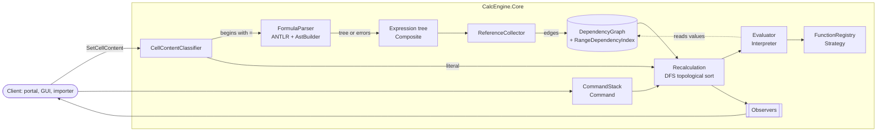

The pipeline in one sentence: *content is classified, formulas are parsed into a
tree, the tree's references become edges in a graph, and a change to any cell
makes the graph produce the exact set of cells to recompute and the order to do
it in.*

### 2.1 Module responsibilities

| Namespace | Responsibility | Depends on |
| --- | --- | --- |
| `Model` | Addresses, ranges, values, errors | nothing |
| `Grammar.Generated` | ANTLR lexer/parser | ANTLR runtime |
| `Parsing` | Text → expression tree, or errors with positions | `Grammar`, `Expressions`, `Model` |
| `Expressions` | The tree ADT, printing, reference extraction | `Model`, `Evaluation` (interfaces only) |
| `Evaluation` | Coercions, the evaluation-context seam | `Model`, `Functions` |
| `Functions` | The function library and its registry | `Model`, `Evaluation` |
| `Dependencies` | The graph, the range index, ordering, cycles | `Model` |
| *(root)* | `Workbook`, `Sheet`, results, observers | everything |
| `Commands` | Undo/redo | root |
| `Features.*` | Find & Replace, Duplicates | root |

The arrows only ever point inwards. `Model` knows about nothing;
`Features` knows about everything. **ANTLR is confined to two namespaces**:
the generated parser, and the four files of `Parsing` that drive it
(`FormulaParser`, `AstBuilder`, `DescriptiveErrorListener`,
`TokenPreValidator`). Nothing else in the solution mentions `Antlr4.Runtime`,
so the parser generator could be replaced without touching the expression tree,
the evaluator, the graph, or either assigned feature — `AstBuilder` is the seam,
because it is the only place the generated parse tree is turned into the
engine's own ADT.

---

## 3. Class design: the expression tree

```mermaid
classDiagram
    class Expression {
        <<abstract>>
        +SourceSpan Span
        +Evaluate(IEvaluationContext) CellValue
        +Accept~T~(IExpressionVisitor~T~) T
    }

    class NumberLiteralExpression { +double Value }
    class TextLiteralExpression { +string Value }
    class BooleanLiteralExpression { +bool Value }
    class ErrorLiteralExpression { +ErrorValue Value }
    class CellReferenceExpression {
        +string? SheetName
        +CellReference Reference
    }
    class RangeReferenceExpression {
        +string? SheetName
        +CellReference From
        +CellReference To
        +CellRange Range
    }
    class UnaryOperatorExpression {
        +UnaryOperator Operator
        +Expression Operand
    }
    class BinaryOperatorExpression {
        +BinaryOperator Operator
        +Expression Left
        +Expression Right
    }
    class FunctionCallExpression {
        +string Name
        +IReadOnlyList~Expression~ Arguments
    }

    Expression <|-- NumberLiteralExpression
    Expression <|-- TextLiteralExpression
    Expression <|-- BooleanLiteralExpression
    Expression <|-- ErrorLiteralExpression
    Expression <|-- CellReferenceExpression
    Expression <|-- RangeReferenceExpression
    Expression <|-- UnaryOperatorExpression
    Expression <|-- BinaryOperatorExpression
    Expression <|-- FunctionCallExpression

    UnaryOperatorExpression o-- Expression : Operand
    BinaryOperatorExpression o-- Expression : Left, Right
    FunctionCallExpression o-- Expression : Arguments

    class IExpressionVisitor~T~ {
        <<interface>>
        +VisitNumber(NumberLiteralExpression) T
        +VisitText(TextLiteralExpression) T
        +VisitCellReference(CellReferenceExpression) T
        +VisitRangeReference(RangeReferenceExpression) T
        +VisitUnary(UnaryOperatorExpression) T
        +VisitBinary(BinaryOperatorExpression) T
        +VisitFunctionCall(FunctionCallExpression) T
    }

    class FormulaPrinter
    class ReferenceCollector
    class TextLiteralFinder

    IExpressionVisitor~T~ <|.. FormulaPrinter
    IExpressionVisitor~T~ <|.. ReferenceCollector
    IExpressionVisitor~T~ <|.. TextLiteralFinder
    Expression ..> IExpressionVisitor~T~ : Accept
```

**Patterns.** Composite (the tree), Interpreter (`Evaluate` on each node),
Visitor (`Accept`, for everything else).

**Why both Interpreter and Visitor.** Evaluation is the hot path — a full
recalculation walks every tree in the workbook — and one virtual call beats a
visitor's double dispatch. Every *other* traversal is open-ended, and there a
new traversal should cost a new class rather than a new method on nine node
types. Committing to one mechanism would have been tidier and worse in one
direction or the other.

**Why the parse tree is lowered rather than used directly.** ANTLR's tree has a
node per grammar rule, including the ones that exist only to encode precedence,
and a node per bracket. The ADT has nine node types, no rule scaffolding, no
brackets (structure encodes them), and no dependency on ANTLR. The AST builder
is also where *semantic* validation of references happens: the lexer accepts
`ZZZZ9` because it is letters-then-digits, and it is the builder that turns it
into “`'ZZZZ'` is beyond the last column, XFD”.

---

## 4. Class design: dependencies and recalculation

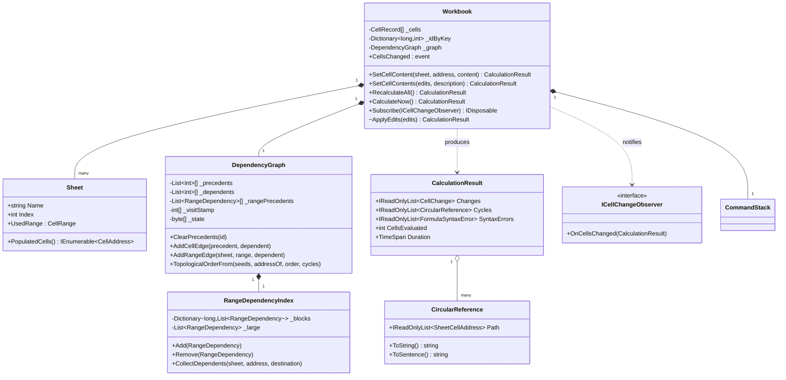

**The recalculation sequence.**

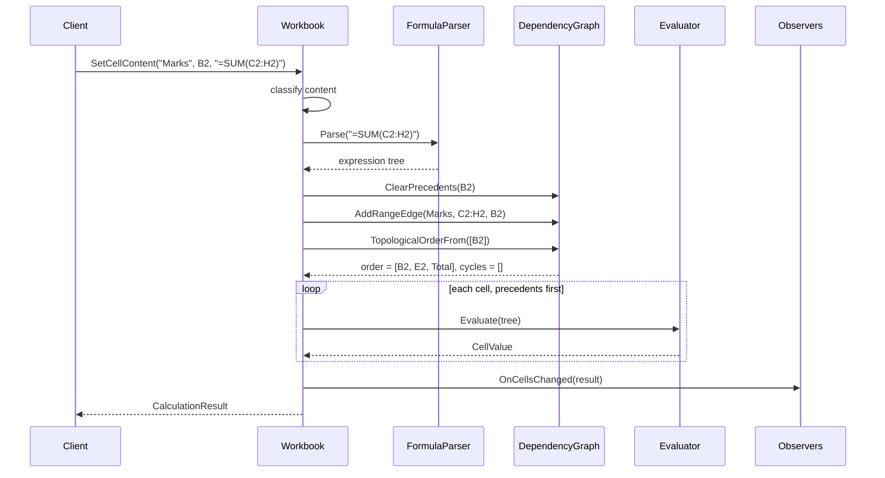

**The three decisions that produce the 0.2 ms figure**, in order of effect:

1. **Dense integer identifiers.** Adjacency is array indexing, not hashing, and
   one graph spans every sheet.
2. **Generation-stamped visit marks.** The traversal never clears its mark
   arrays. Clearing 100,000 flags per keystroke would alone cost more than the
   whole propagation now does.
3. **A spatial range index instead of expanded edges.** See §6.

---

## 5. Class design: evaluation and the function library

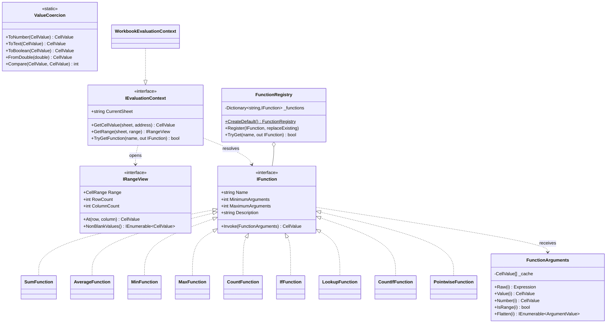

**Patterns.** Strategy (`IFunction`), Factory / registry (`FunctionRegistry`),
Adapter (`PointwiseFunction`, for the two dozen functions that differ only by a
lambda).

**Functions receive their arguments unevaluated.** This is the single most
consequential decision in the module. `IF` must not evaluate the branch it does
not take, or `=IF(A1=0,"n/a",B1/A1)` — the standard guard against a missing
denominator — would report `#DIV/0!` for exactly the input it was written to
handle. `FunctionArguments` evaluates on first access and caches, so a function
that reads an argument twice pays once and one that never reads an argument
never evaluates it.

**`ArgumentValue.FromReference` is not bookkeeping.** Excel ignores text read
*through a reference* and coerces text written *into the formula*: `=SUM(A1:A9)`
and `=SUM(A1)` ignore a cell containing "absent", but `=SUM("3")` is 3.
Departmental sheets record absences as text in the marks column, so losing this
distinction would silently change every total.

**`IRangeView` has two access paths for two costs.** `NonBlankValues()` is what
the aggregates use, and the workbook implements it by walking whichever is
smaller — the rectangle or the sheet's populated cells — so `=SUM(A1:A100000)`
over a sheet holding twelve values touches twelve values. `At(row, column)` is
positional, which `LOOKUP` needs and the aggregates do not.

**The registry is open.** The portal can register a `CAWEIGHT` that encodes the
departmental 30/70 split without forking the engine or touching the grammar,
because the grammar already accepts any identifier followed by `(`. Shadowing a
built-in requires saying `replaceExisting: true` — a workbook whose `SUM` means
something private is a workbook whose numbers cannot be reproduced anywhere
else, and that is worth one extra argument to prevent.

---

## 6. The range-dependency problem, in full

This is the design decision we would most want to be asked about.

`=SUM(B2:B45)` depends on 44 cells. The obvious implementation expands the range
into 44 edges. It is wrong for three reasons, in increasing order of severity:

1. **Cost.** One such formula per course per level is millions of edges to tear
   down and rebuild every time a lecturer widens a range by one row.
2. **Memory.** `=SUM(A1:A100000)` in a hundred formulas is ten million edges.
3. **Correctness — the fatal one.** Typing into a cell that was *empty when the
   formula was written* must still trigger the formula. An empty cell has no
   identity to hang an edge on, so an expanded-edge design either misses the
   update or must pre-create identities for every cell any range could ever
   cover.

The alternative we rejected second was a per-sheet list of ranges scanned on
every change: correct, trivial, and `O(number of range formulas)` per keystroke.

**What we built.** The grid is cut into 64×64 blocks. A range is filed under
every block it intersects; a changed cell is looked up by its own block and the
few candidates filed there are tested for containment. Ranges spanning more than
1,024 blocks — which our grammar makes hard to write, since it has no
whole-column references — fall back to a small always-scanned list, so a
pathological `A1:XFD1048576` costs one entry rather than four million.

The block size is the tuning knob: smaller blocks mean more index entries per
range and fewer candidates per lookup. 64 was chosen because it keeps a typical
column range (`B2:B45`) to a single entry while keeping a full-column-height
range under 20,000.

`WritingIntoAPreviouslyEmptyCellOfARangeStillTriggersIt` is the test that pins
reason 3 — the property the whole structure exists for.

---

## 7. Class design: the assigned features

### 7.1 Find and Replace

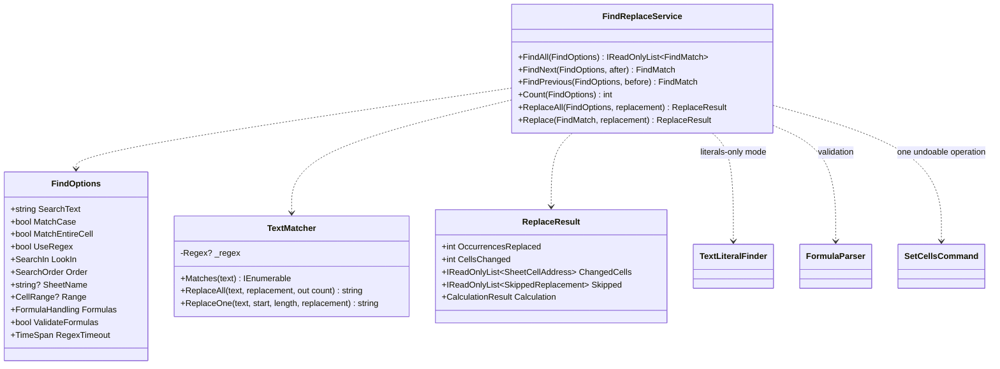

Searching a spreadsheet is easy. Replacing in one is not, because three of the
places a match can be found are places a naive replace corrupts:

| Where the match is | What a naive replace does | What CalcEngine does |
| --- | --- | --- |
| In a formula's *structure* — "B2" inside `=SUM(B2:B9)` | Silently rewrites the range and changes every total | `FormulaHandling.TextLiteralsOnly` rewrites only inside quoted text, using the parsed tree and its `SourceSpan`s |
| In a *computed value* | Writes to a cell that does not hold that text, or does nothing without saying so | Reports the cell in `Skipped` with `ComputedValue` and an explanation |
| Where the result would not parse | Stores a broken formula | Re-parses before writing; refuses with the parser's own message |

The default mode is `WholeContent` — Excel's behaviour — because it is what
someone renaming a course code usually wants. But the alternative exists, is one
enum away, and the difference between them is pinned by two adjacent tests so it
cannot regress unnoticed.

Two smaller decisions worth stating: the regular-expression engine runs with a
one-second timeout, because a user-supplied `(a+)+$` must not hang the grid; and
`$1` group references expand *only* in regex mode, so replacing "USD" with "$"
means a dollar sign.

The whole pass is one `SetCellsCommand`: one recalculation, one notification,
one Ctrl+Z.

### 7.2 Duplicate detection and removal

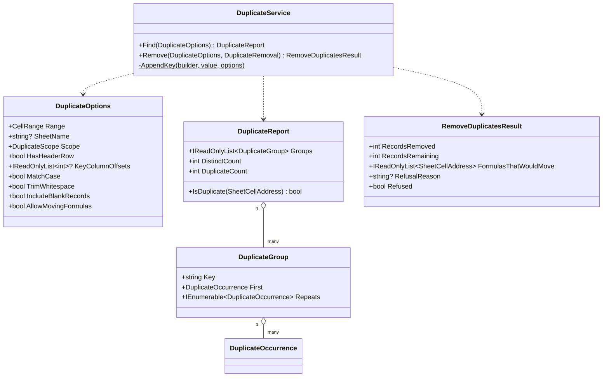

**Detection is one linear pass.** Each record is reduced to a canonical key and
grouped in a dictionary: 50,000 rows cost 50,000 key builds and 50,000 hash
lookups, against the 1.25 billion comparisons of the pairwise approach.

**The key is typed and length-prefixed.** The type tag keeps the number `5` apart
from the text `"5"`, so an imported column of text marks does not appear to
duplicate a typed one. The length prefix keeps the record `{"a","b"}` apart from
`{"ab",""}`, which a naive concatenation declares identical. Formulas contribute
their *value*, because two rows computing the same grade by different routes are
the same record.

**Removal, and a limit we chose deliberately.** Three modes:

* `ClearContents` (default) blanks the repeats where they stand. Nothing moves,
  so nothing that refers into the range can be silently redirected.
* `ShiftUp` compacts the survivors, as Excel's Remove Duplicates does.
* `MarkOnly` produces the report and changes nothing.

`ShiftUp` moves raw content, and **relative references do not follow it**. Full
row-delete semantics — rewriting every formula in the workbook so that references
below the deleted rows shift up and references *into* them become `#REF!` — is
what a real spreadsheet does, and we did not build it. It is a whole-workbook
formula rewrite, it needs its own ADT (a reference-translating visitor) and its
own test suite, and a half-implemented version is worse than none because it
would be *silently* wrong.

What we did instead is refuse: if compacting would relocate a formula, `ShiftUp`
changes nothing, names the cells in `FormulasThatWouldMove`, and explains why in
`RefusalReason`. The caller can set `AllowMovingFormulas` to proceed with the
verbatim move. That is an honest limit with a safe default, and
`ShiftUpRefusesToMoveFormulasUnlessTheCallerInsists` holds it in place.

---

## 8. Undo/redo and change notification

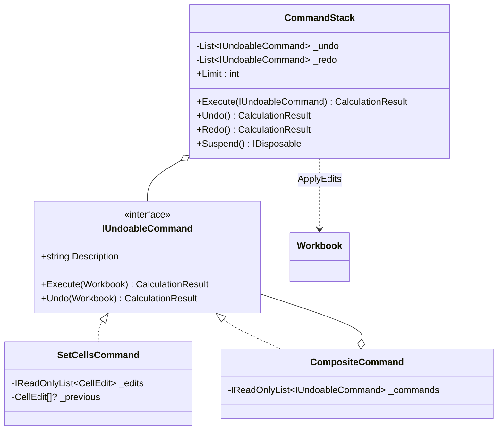

**One writing path.** `SetCellsCommand` is the only command that touches
content; Find & Replace, Remove Duplicates, a paste and a bulk import are all
the same command with more edits in it. One place undo can be got wrong means
one place to test.

**Observer, twice over.** `Workbook.CellsChanged` is a C# event, because that is
what a C# client expects; `ICellChangeObserver` is an interface, because a client
with several observers of its own — a grid, an audit log, a dirty-document flag —
wants to pass them around as values. Both see the same `CalculationResult`.

---

## 9. GUI client

An ASP.NET Core Blazor Server application. It was chosen over WPF or WinForms
because it runs on every platform the department might mark it on, and because
it makes the reactive claim *visible*: the server pushes only the cells that
changed, and the grid flashes exactly those.

The important architectural point is that **the client is not privileged**. It
reads through the public `Workbook` API and subscribes through the same
`ICellChangeObserver` any consumer would use; `WorkbookSession` is a per-circuit
scoped service holding selection and viewport state, and nothing in it leaks back
into `CalcEngine.Core`.

What the grid shows that a plain grid does not:

* error values in red, with the engine's own `ErrorValue.Detail` as the tooltip;
* cells in a cycle shaded distinctly, with a banner naming the exact ring
  (`L2 → L3 → L4 → L2`);
* cells touched by the last recalculation flashing green — so editing one mark
  visibly moves the total, the grade and the class average;
* a diagnostics panel reporting `CellsEvaluated` and `Duration` for the last
  edit, which is the reactive claim as a number.

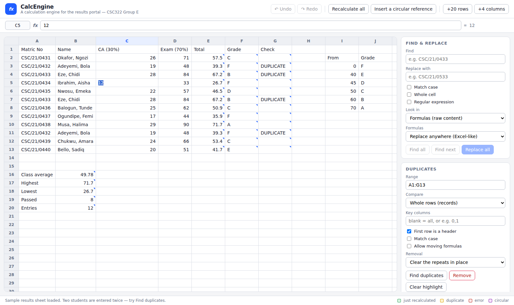

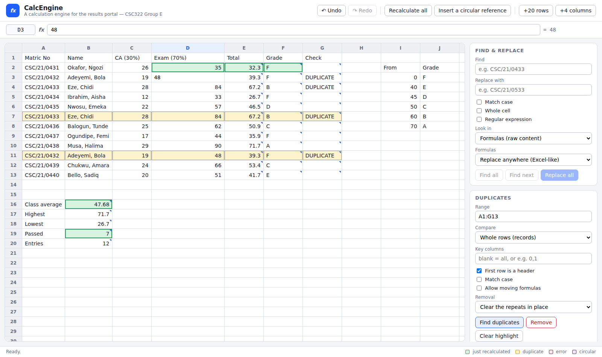

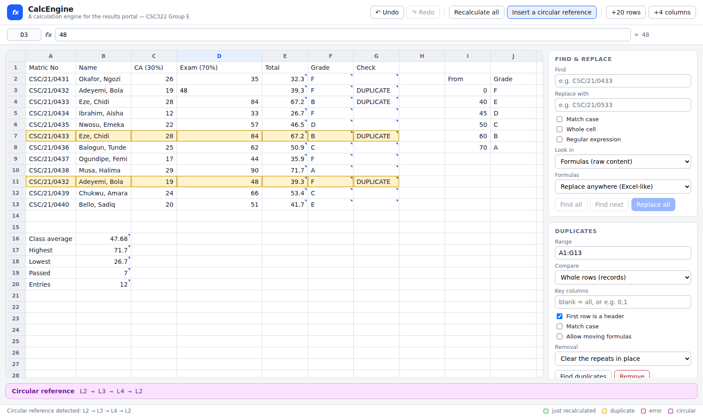

---

## 10. Design decisions, and the alternatives we rejected

| Decision | Alternative considered | Why we chose as we did |
| --- | --- | --- |
| Range dependencies in a 64×64 spatial index | Expand ranges into per-cell edges | Expansion cannot fire when a previously empty cell inside the range is filled in (§6) |
| Generation-stamped visit marks | Clear a visited set per traversal | Clearing 100,000 flags per keystroke costs more than the propagation |
| Explicitly stacked DFS | Recursion | A 20,000-cell chain is ordinary; `StackOverflowException` cannot be caught |
| Interpreter for evaluation, Visitor for the rest | One mechanism for both | Double dispatch on the hot path, or nine new methods per traversal |
| Unevaluated function arguments | `IReadOnlyList<CellValue>` | `IF` must not evaluate the branch it does not take |
| `#PARSE!` stored, edit accepted | Reject the edit like Excel's dialogue | An API cannot show a dialogue; a bulk importer needs the bad text kept and flagged |
| `-2^2 = 4` | Mathematical convention | The engine exists to run formulas copied out of Excel (`grammar.md` §4.1) |
| No whole-column ranges (`A:A`) | Support them | One edge would stand for 1,048,576 cells and defeat the range index |
| Duplicate `ShiftUp` refuses to move formulas | Move them silently, or rewrite references | A silent move is the corruption we exist to prevent; a proper rewrite is a separate feature (§7.2) |
| Cells in one flat array under dense ids | Per-sheet `Dictionary<CellAddress, Cell>` | Array-speed adjacency; one graph across sheets; ~100,000 fewer allocations |
| `CellValue` as a 24-byte struct | A class hierarchy of value types | No allocation for the numeric case that dominates a workbook |

---

## 11. What is not built, and what we would do next

Stated plainly, because a design portfolio that lists only what worked is not a
design portfolio.

* **Structural edits** — insert/delete row or column, with reference rewriting.
  This is the missing capability behind the `ShiftUp` limitation (§7.2), and the
  expression tree, the printer and the source spans are already the right
  foundation for it.
* **Named ranges and array formulas.** Both are grammar extensions plus
  evaluation work; neither was assigned.
* **Persistence.** The engine has no file format. `Workbook` is reconstructible
  from a list of `CellEdit`s, so a format is a serialisation exercise rather than
  a design one.
* **Parse throughput.** 60 µs per formula is ANTLR doing full-context
  prediction; `PredictionMode.SLL` with an LL fallback typically wins 2–5×.
  Load time has no published target, so this is deliberately left as measured
  work rather than an untested change (`benchmarks.md` §5).
* **Thread safety.** `Workbook` is single-threaded by design and says so. With a
  25× margin on the only published target, adding threads to a structure this
  mutable would be buying risk we do not need.
